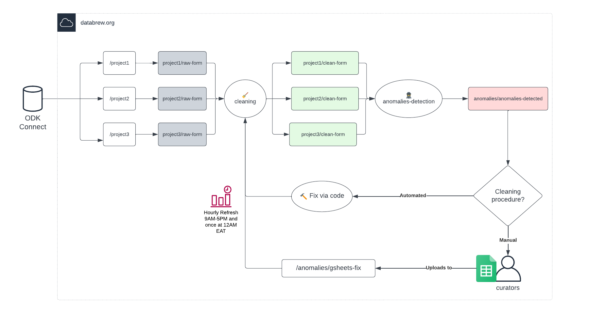

# ODK to AWS Process for Data Curators

In `databrew.org` bucket - files are organized as projects. Each projects will contain different steps and staging of the data curation processes. Inside databrew.org will also contain anomalies folder where it will be used as a detection/amendment process for data QA

S3 Folder Hierarchy Structure for Projects:

1.  `project`: Name of the project from ODK Server

2.  `raw/clean-form`: Indicator whether form has been cleaned or not

3.  `form-id`: Form ID shown in ODK Server

4.  `form`: CSV Form and Repeats: Form Data from ODK Server

S3 Folder Hierarchy Structure for Anomalies:

1.  `gsheets-fix`: This is where you upload [google sheets manual fix](https://docs.google.com/spreadsheets/d/1i98uVuSj3qETbrH7beC8BkFmKV80rcImGobBvUGuqbU/edit#gid=0)

2.  `detection-history`: This is where anomalies detection data is dump, it will take historical data to show how much anomalies have been reduced by day

3.  `detection-current`: Current state of anomalies

4.  `adhoc-fix`: Any manual amendment data that is used to clean the data that can't be fixed via manual gsheets fix

## Pipeline Overview

## How to submit Resolution

Submitting resolution is an ad-hoc manual process and not automated to prevent automatic errors. 

1. Go to this [sheet](https://docs.google.com/spreadsheets/d/1i98uVuSj3qETbrH7beC8BkFmKV80rcImGobBvUGuqbU/edit#gid=0)

2. Save file as `odk_form_anomalies - resolution.csv`

3. Submit file to this [S3 bucket](https://s3.console.aws.amazon.com/s3/upload/databrew.org?region=us-east-1&prefix=anomalies/gsheets-fix/)

4. Rerun this [step function](https://us-east-1.console.aws.amazon.com/states/home?region=us-east-1#/statemachines/view/arn:aws:states:us-east-1:354598940118:stateMachine:ODKBatch1437FF8A-eSt3mYmvwFfK)

5. After uploading resolution file to S3, and if there are no errors in step-function, mark `Status` in Google Sheets as `Done`