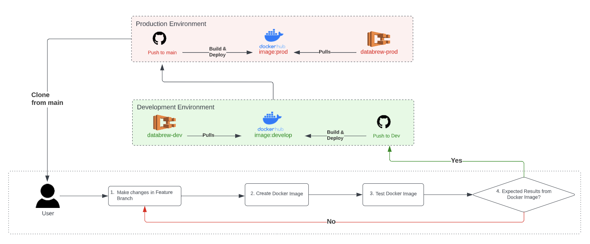

### CI/CD OVerview

 

1. Clone and make changes in your feature-branch 

2. Create Dockerfile based on your changes (library installation, new R script, bash script) 

3. Test Dockerfile locally, check whether everything runs based on your use-case 

4. Push your changes to `dev branch`: By pushing your changes to the dev branch,
`github action` will trigger a job that automatically deploys your
changes to Dockerhub - image in Dockerhub will be tagged with version
`:develop` 

5. Check `databrew-dev (aws)` to see whether data inputs/ouputs are behaving as expected 

6. Once done, push your changes to `main branch`: Same process as 4, image in Dockerhub will be tagged with version `:production` 

7. Changes will be sync-ed in `databrew-prod (aws)`

Automation using github action is based on the `yaml` files specified
under [github workflows folder](.github/workflows), it needs to be
configured manually if the service you create not yet available.

### Clone this repository

    git clone https://github.com/databrew/bohemia-kenya-data-pipeline.git

### Create a feature branch

To make contribution to data workflow, start by creating a feature
branch.

    git checkout -b [name_of_your_new_branch]
    git push origin [name_of_your_new_branch]

\*Preferred git branch naming convention:
[email_handle]\_[feature_name]\*

### Folder Structure Requirements for Workflow Orchestration

Each folder is a microservice used for data orchestration. Each folder
will have these 4 components:

    |-- your-workflow-folder
            |-- renv.lock
            |-- Dockerfile
            |-- Makefile
            |-- R/

-   `renv.lock`: This is the file used to create virtual environment
    in R. It snapshots your local session library and locks the library
    versioning to make sure full-reproducibility of data pipeline.
-   `Dockerfile`: This is the Dockerfile used for creating fresh
    container to run the data workflow. Docker is used to help deploy
    resources to fresh AWS instance
-   `Makefile`: This file is a helper to streamline running R scripts
    (can be changed to .sh executable if needed)
-   `R/`: This is where your Rscript lives

## 2. Modify Existing Pipeline Workflow

To work/modify on existing folder, you can directly work inside the
folder. Create an individual `.Rproj` on each of the folder in RStudio.

### Reproducing Production R Environment using `Renv` in RStudio

Once you are inside the folder, you will be able to reproduce the
libaries used in production using following commands:

``` r
install.packages("renv")
renv::init(bare = TRUE)
renv::restore()
```

### Adding new library to `Renv` virtual environment

Adding new libraries will require you to record the changes to the
`renv.lock`. Let's use installing R `Lubridate` for example:

``` r
install.packages("lubridate")
renv::snapshot()
```

Running this command will snapshot the lubridate package into the
`renv.lock` library index

#### Adding new R scripts

To streamline running several R scripts, edit the `Makefile`/`bash`
files and add the new R Scripts

## 3. Creating New Pipeline Workflow

To create a new worfklow, start by creating a new folder under this
repository.

### Create `R Project` in New Folder

    mkdir [your_new_workflow_folder]

Once directory is created, create RProject using the new directory

### Work like you normally would in `R/`

You are free to design how your features look like and put your Rscripts
under `R/` folder \### Persist your RStudio Environment and Libraries
into renv Once you are done with the new feature, save your environment
into `renv.lock` by doing

``` r
library(renv)
renv::init()
```

### Create a Dockerfile

Follow guidelines from [Writing
Dockerfile](docs/writing_dockerfile_guideline.md)

### Add CI/CD to Dockerhub

Follow guidelines from [Writing GitHub Action for
CI/CD](docs/writing_gh_actions_guideline.md)
